# heatExchangeCoupling

## Temperature Solver

### Governing Equations and Approximation

The heat equation in 2 dimensions is given by the PDE below, where $\alpha$ is the diffusivity constant of the material.

$\frac{\partial T}{\partial t} = \alpha \Delta T$ where $\Delta T = \frac{\partial^2 T}{\partial^2 x} + \frac{\partial^2 T}{\partial^2 y}$

We can solve this numerically using the Finite Difference method which relies on the approximation:

$\frac{\partial f(x)}{\partial x} \approx \frac{f(x+h)-f(x)}{h}$ for small $h$.

This comes from the first principle definition of the derivative but can also be derived from the taylor series expansion of a function. See [here](https://www.youtube.com/watch?v=ZuxAZxguv-0) or [here](https://github.com/barbagroup/CFDPython/tree/master) for a full walk through of the discretisation in time and space.

Applying the discretisation we get the following discretised expressions for the temperature gradient.

$\frac{\partial T}{\partial t} \approx \frac{1}{\Delta t}(T(t_0 + \Delta t, x_0, y_0)-T(t_0, x_0, y_0))$

$\frac{\partial^2 T}{\partial^2 x} \approx \frac{1}{\Delta x^2}(T(t_0,x_0+\Delta x, y_0) - 2T(t_0, x_0, y_0) + T(t_0, x_0 - \Delta x, y_0))$

$\frac{\partial^2 T}{\partial^2 y} \approx \frac{1}{\Delta y^2}(T(t_0,x_0, y_0+\Delta y) - 2T(t_0,x_0, y_0) + T(t_0, x_0, y_0 - \Delta y))$

Where $\Delta t$, $\Delta x$ and $\Delta y$ are user defined parameters. From a CFD perspective you can view $\Delta x$ and $\Delta y$ as the mesh resolution and $\Delta t$ as the simulation timestep. Using smaller values of these parameters generally improves accuracy. However these must be set in tandem with each other, see [Courant number](https://en.wikipedia.org/wiki/Courant%E2%80%93Friedrichs%E2%80%93Lewy_condition).

Subbing in our approximations to the heat equation we get:

$\frac{1}{\Delta t}(T(t_0 + \Delta t, x_0, y_0)-T(t_0, x_0, y_0)) = \alpha(\frac{1}{\Delta x^2}(T(t_0,x_0+\Delta x, y_0) - 2T(t_0, x_0, y_0) + T(t_0, x_0 - \Delta x, y_0)) + \frac{1}{\Delta y^2}(T(t_0,x_0, y_0+\Delta x) - 2T(t_0, x_0, y_0) + T(t_0, x_0, y_0 - \Delta y)))$

Rearranging:

$T(t_0 + \Delta t, x_0, y_0) = T(t_0, x_0, y_0) + \alpha (\frac{\Delta t}{\Delta x^2}(T(t_0,x_0+\Delta x, y_0) - 2T(t_0, x_0, y_0) + T(t_0, x_0 - \Delta x, y_0)) + \frac{\Delta t}{\Delta y^2}(T(t_0,x_0, y_0+\Delta x) - 2T(t_0, x_0, y_0) + T(t_0, x_0, y_0 - \Delta y)))$

Let $T^n_{i, j} = T(t_0, x_0, y_0)$ i.e Temperature at current time and location, then:

$T_{i, j}^{n+1} = T^n_{i, j} + \alpha \frac{\Delta t}{\Delta x^2}(T^n_{i+1, j} -2T^n_{i, j}+T^n_{i-1,j}) + \alpha \frac{\Delta t}{\Delta y^2}(T^n_{i, j+1} -2T^n_{i, j}+T^n_{i,j-1})$

This is an expression for the temperature at the next timestep in terms of entirely known variables. We can compute this iteratively to solve for temperature at a given time (given we know some inital state).

### Python Implementation

The python module temperatureSolver implements the above discretisation. The code assumes that some temperature is applied evenly across the leftmost boundary and then calculates the resulting temperature gradient at equilibrium. For small values of nodes the gradient can be viewed in real time but incurs considerable slowdown. There are several cases that can be immediately run with the following parameters as input.

```bash
usage: main.py [-h] [--height HEIGHT] [--length LENGTH] [--alpha ALPHA] [--nodes NODES] [--solverNum SOLVERNUM]

options:
  -h, --help            show this help message and exit
  --height HEIGHT
  --length LENGTH
  --alpha ALPHA
  --nodes NODES
  --solverNum SOLVERNUM
```

MUI is used to allow multiple solvers with different parameters to communicate and solve more complex cases. 

#### numpy implementation

 TODO

#### MUI communication

TODO

#### Multiple Layers

In the original temperature equation discretisation it is assumed that $\alpha$ is some constant (Spatially Independent) that we can essentially ignore until the end. When we have more than 1 material this is no longer case as alpha is now spatially dependent and must be included in the maths. In the end this gives a very similar [equation](https://physics.stackexchange.com/questions/107761/how-to-solve-the-heat-equation-for-compound-materials-with-different-heat-conduc):

$T_{i, j}^{n+1} = T^n_{i, j} + \frac{\Delta t}{\Delta x^2}(\alpha_{i+0.5}(T^n_{i+1, j} -T^n_{i, j})+\alpha_{i-0.5}(T^n_{i-1, j} -T^n_{i, j})) + \alpha_i\frac{\Delta t}{\Delta y^2}(T^n_{i, j+1} -2T^n_{i, j}+T^n_{i,j-1})$

Where $\alpha_{i+0.5} = \frac{\alpha_{i+1} + \alpha_i}{2}$
#### Validation

The following validation cases are based on this [site](https://www.fifty2.eu/innovation/conduction-through-a-composite-wall/)

##### Case1 - 1 Layer

To run use:

```bash
python3 -m temperatureSolver.case1.main --nodes 200
```

This is the simplest case with only 1 layer.

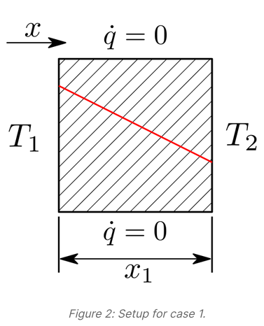

###### Parameters

- Layer length $x_1 = 0.05m$
- Layer height: 1m (this is irrelevant in practice since flux at the top and bottom is always 0)
- Inital Temperature $T_1 = 100$
- Final Temperature $T_2 = 0$
- Thermal diffusivity $\alpha = 1.22 \times 10^{-5} $ ([Pure Gold](https://www.engineersedge.com/heat_transfer/thermal_diffusivity_table_13953.htm))
- Simulation time: 20s
- number of nodes: 40,000 (200x200)

###### Results

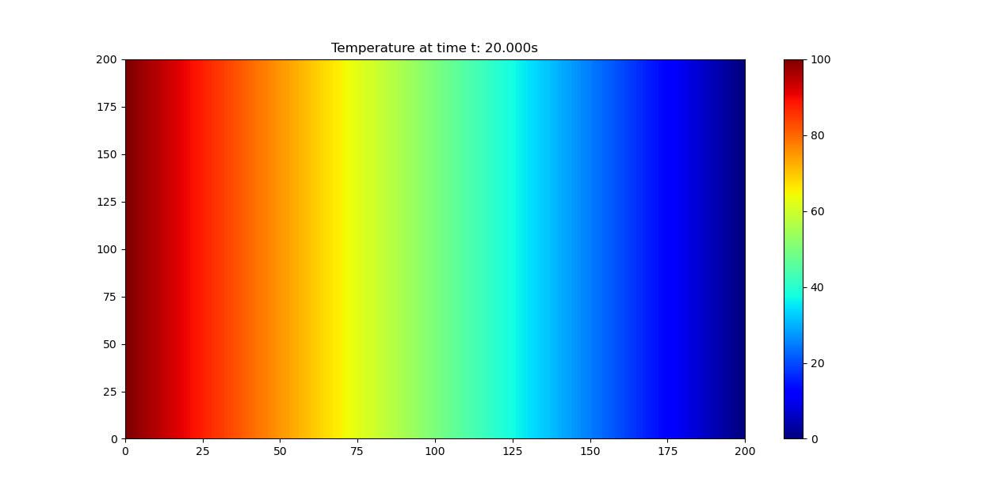

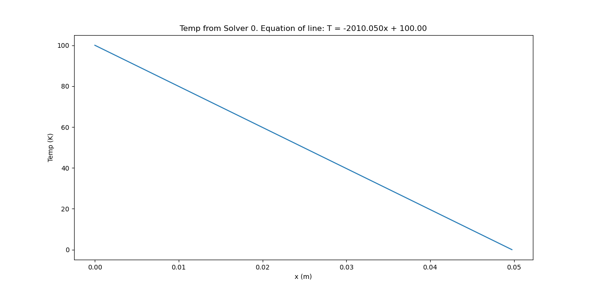


###### Comments

Using the equations $T(x) = T_2 - \frac{Q}{k A}x$ and $Q = \frac{-k A}{x_1}(T_2-T_1)$ (from [here](https://www.fifty2.eu/innovation/conduction-through-a-composite-wall/)) the theoretical temperature distribution should be:

$T(x) = T_2 - \frac{(T_1-T_2)}{x_1}x = 100 - \frac{100}{0.05}x = 100 - 2000x$

Note that the surface area at the boundary $A=1$ since the height is 1 and the model ignores the z direction. Thus the error in $T_1$ is 0% and the error in $\frac{\partial T}{\partial x}$ is 0.005%

##### Case2.0 - 2 Layers 1 Material

To run use:

```bash
mpirun -np 2 python3 -m temperatureSolver.case2.main --length 0.025 --nodes 100
```

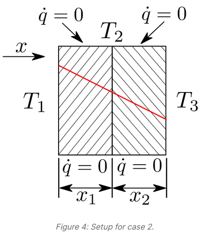

###### Parameters

- Layer length $x_1 = 0.025$ m, $x_2 = 0.025$ m
- Layer height: 1m (this is irrelevant in practice since flux at the top and bottom is always 0)
- Inital Temperature $T_1 = 100$
- Final Temperature $T_3 = 0$
- Thermal diffusivity $\alpha_1 = \alpha_2 = 1.27 \times 10^{-4} $ ([Pure Gold](https://www.engineersedge.com/heat_transfer/thermal_diffusivity_table_13953.htm))
- Simulation time: 20s
- number of nodes: 20,000 (100x100x2)

###### Results

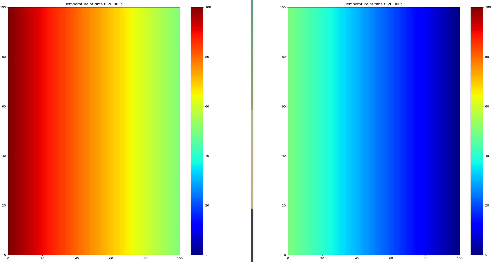

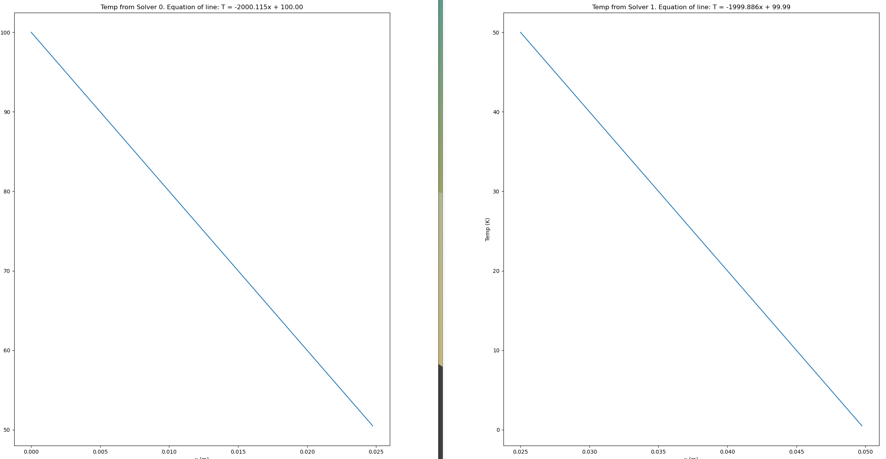


###### Comments

Now we should obtain a different gradients for each solver as the second plate has a lower diffusivity

##### Case2.1 - 2 Layers 2 Materials

To run use:

```bash
mpirun -np 1 python3 -m temperatureSolver.case2.main --length 0.025 --nodes 100 : -np 1 python3 -m temperatureSolver.case2.main --length 0.025 --nodes 100 --alpha 2.5e-4
```

###### Parameters

- Layer length $x_1 = 0.025$ m, $x_2 = 0.025$ m
- Layer height: 1m (this is irrelevant in practice since flux at the top and bottom is always 0)
- Inital Temperature $T_1 = 100$
- Final Temperature $T_3 = 0$
- Thermal diffusivity $\alpha_1 = 1.27 \times 10^{-4} $ ([Pure Gold](https://www.engineersedge.com/heat_transfer/thermal_diffusivity_table_13953.htm)) $\alpha_2 = 2\alpha_1 = 2.54 \times 10^{-4}$
- Simulation time: 20s
- number of nodes: 20,000 (100x100x2)

###### Results

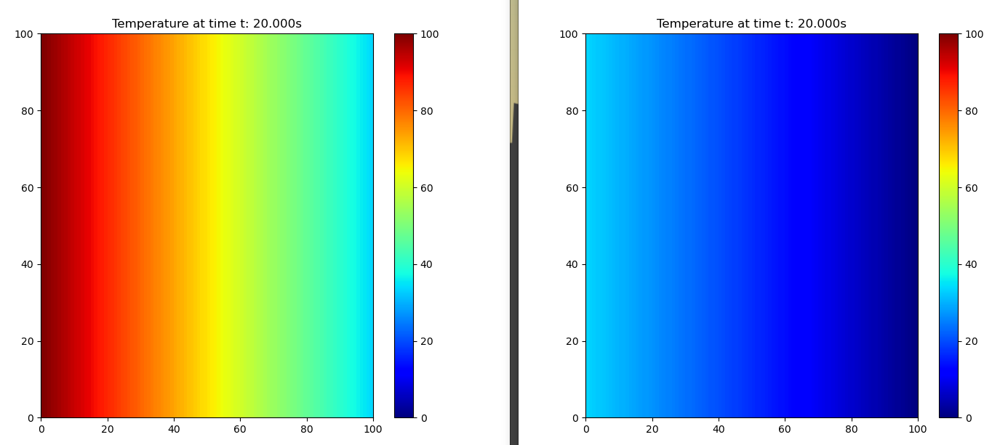

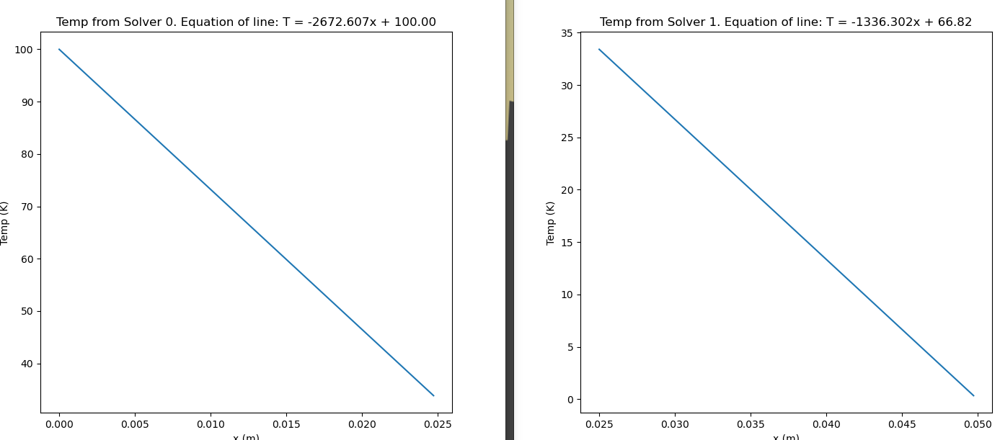


###### Comments

Theoretically, the value of $T_2$ should be:

$T_2 = T_1 - \frac{Qx_1}{Ak_1}$ where $Q = \frac{T_1-T_3}{\frac{x_1}{k_1 A} + \frac{x_2}{k_2 A} } = \frac{100}{\frac{x_1}{k_1}+\frac{x_1}{2k_1}} = \frac{200k_1}{3x_1}$

Subbing $Q$ in we obtain
$T_2 = 100 - \frac{200k_1 x_1}{3A k_1 x_1} = 100 - \frac{200}{3} = 33.33$

The measured value of $T_2$ is 33.85 (+1.5%)

##### Case2.2 - 3 Layers 3 Materials

To run use:

```bash
mpirun -np 1 python3 -m temperatureSolver.case2.main --length 0.025 --nodes 100 : -np 1 python3 -m temperatureSolver.case2.main --length 0.025 --nodes 20 --alpha 2.5e-4 : -np 1 python3 -m temperatureSolver.case2.main --length 0.025 --nodes 100 --alpha 0.635e-4
```

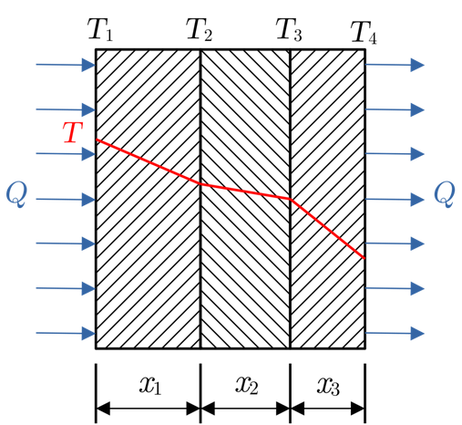

###### Parameters

- Layer length $x_1 = 0.0125$ m, $x_2 = 0.0125$ m, $x_3 = 0.0125$ m
- Layer height: 1m (this is irrelevant in practice since flux at the top and bottom is always 0)
- Inital Temperature $T_1 = 100$
- Final Temperature $T_4 = 0$
- Thermal diffusivity $\alpha_1 = 1.27 \times 10^{-4} $ ([Pure Gold](https://www.engineersedge.com/heat_transfer/thermal_diffusivity_table_13953.htm)) $\alpha_2 = 2\alpha_1 = 2.54 \times 10^{-4}$, $\alpha_3 = \frac{\alpha_1}{2} = 0.635 \times 10^{-4}$
- Simulation time: 20s
- number of nodes: 30,000 (100x100x3)

###### Results
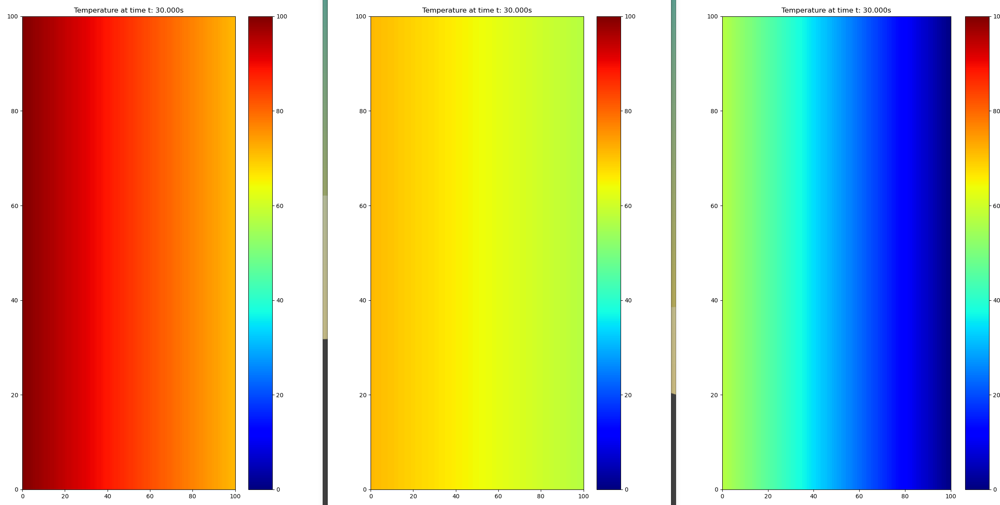

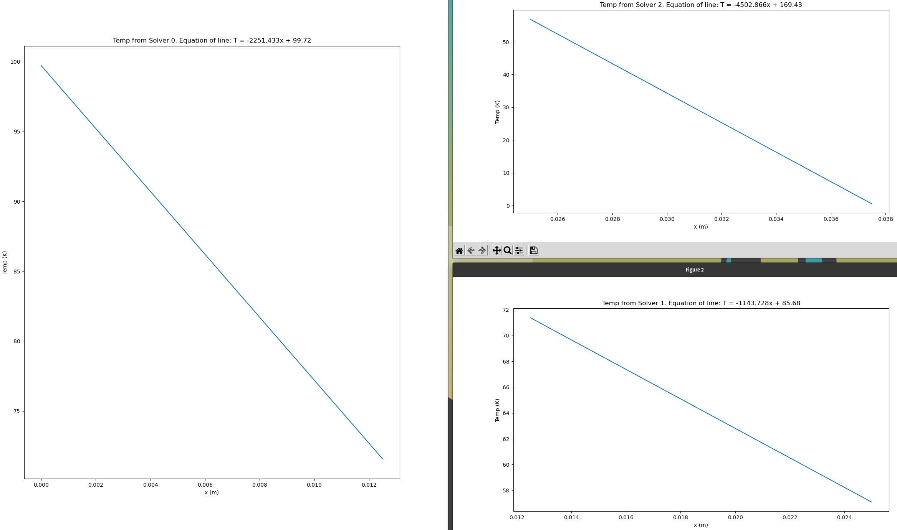

######  Runtime: 102.53s*
*because $dt$ is proportional to $dx^2$.


###### Comments

Using the same method from the previous case but with 3 layers/materials the theoretical values obtained are $T_2=71.43$ and $T_3=57.14$. The measured values are $T_2=71.57$ and $T_3=57.08$ giving an average error of 0.15%.

##### Case3 - Fixed heat flux

To run use:

```bash
mpirun -np 1 python3 -m temperatureSolver.case3.main --length 0.025 --nodes 100 : -np 1 python3 -m temperatureSolver.case3.main --length 0.025 --nodes 100 --alpha 2.5e-4
```

###### Parameters

- Layer length $x_1 = 0.025$ m, $x_2 = 0.025$ m
- Layer height: 1m (this is irrelevant in practice since flux at the top and bottom is always 0)
- heat flux $Q= 848,000$ W/mk
- final temperature $T_2 = 0$
- Thermal diffusivity $\alpha_1 = 1.27 \times 10^{-4} $ ([Pure Gold](https://www.engineersedge.com/heat_transfer/thermal_diffusivity_table_13953.htm)) $\alpha_2 = 2\alpha_1 = 2.54 \times 10^{-4}$
- Thermal conductivity: $k_1 = 318 $ ([Pure Gold](https://en.wikipedia.org/wiki/List_of_thermal_conductivities)) $k_2 = 2k_1 = 636$
- Simulation time: 30s
- number of nodes: 20,000 (100x100x2)

###### Results
$T_0 = 100.16$

######  Runtime: 13.409s

###### Comments

Theoretically we should measure $T_0 = 100$ since:

$Q = \frac{T_0 - T_2}{\frac{x_1}{k_1A} + \frac{x_2}{k_2A}}$ thus (note: A is still 1):

$T_0 = Q (\frac{x_1}{k_1} + \frac{x_2}{2k_1}) = 848000(\frac{0.025}{318} + \frac{0.025}{636}) = 100$

In reality we measure $T_0 = 100.16$ giving an error of 0.16%
